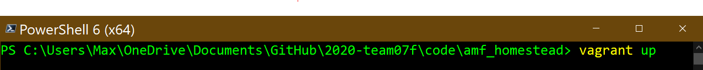
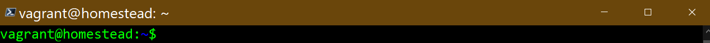
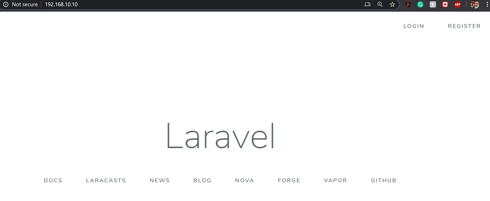
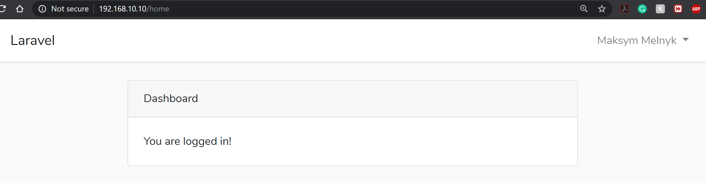
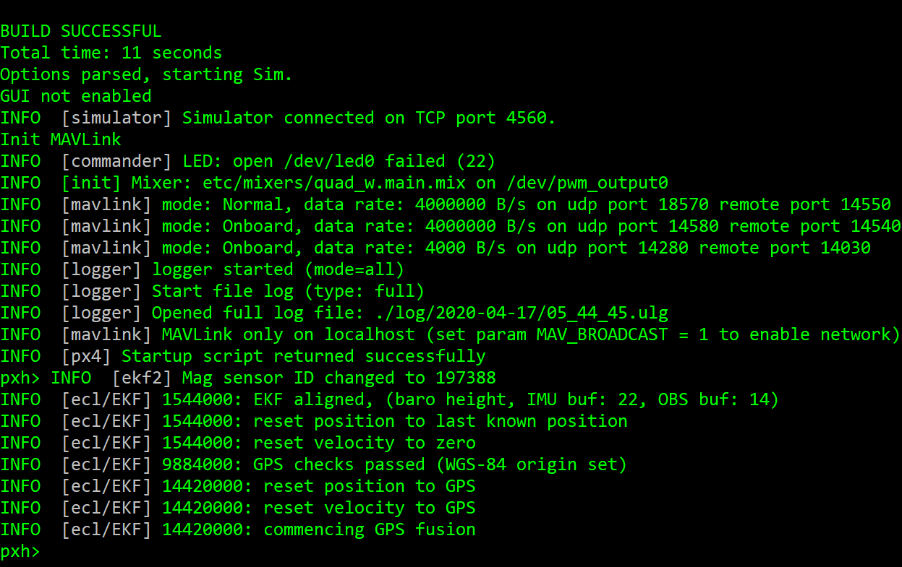
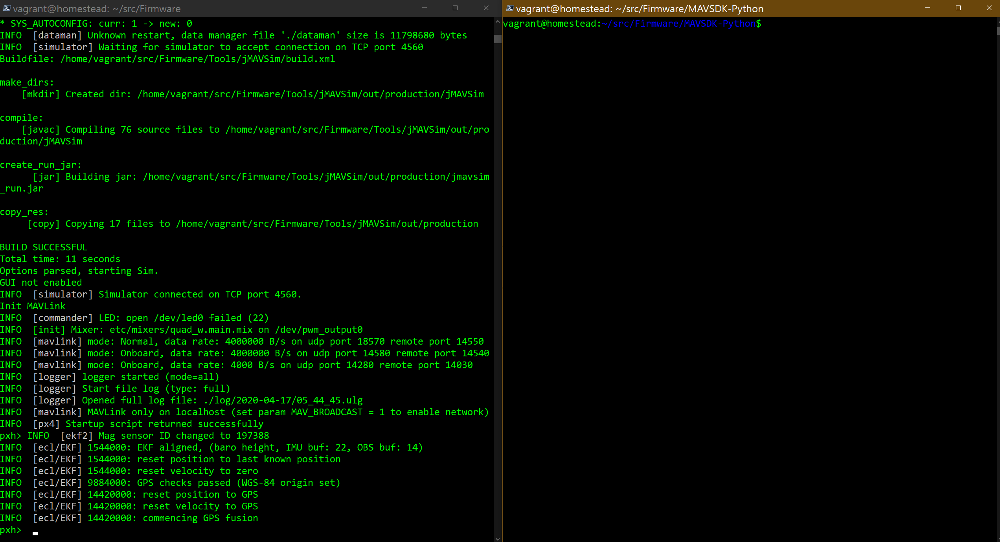
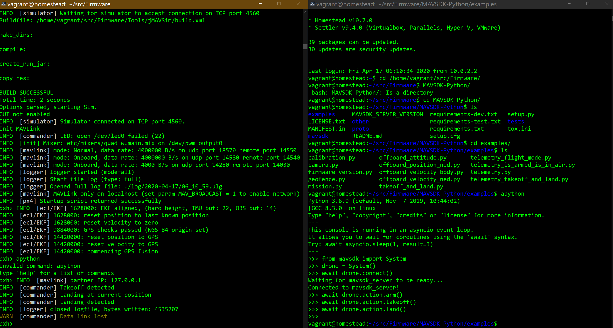
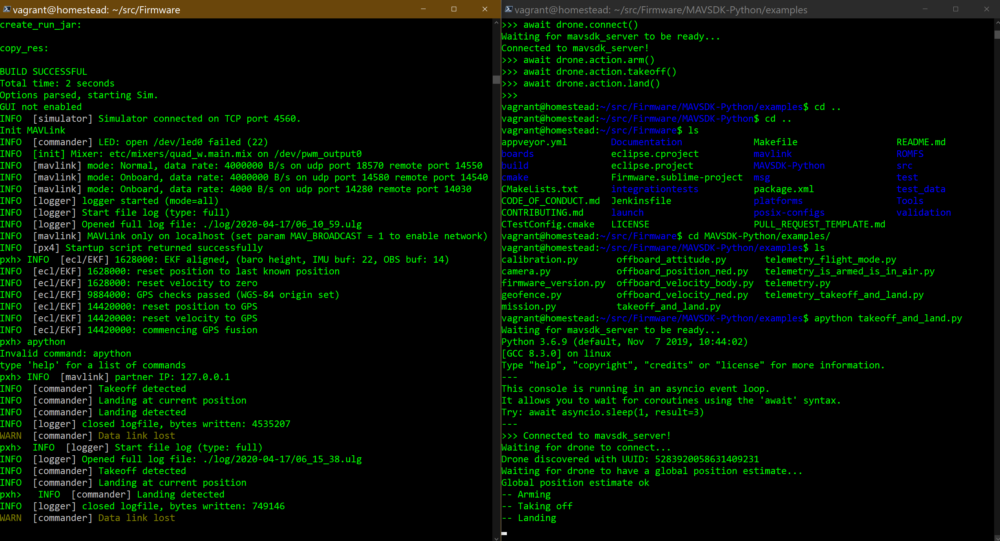

# Install Notes

## First Steps

To begin, install some version of Virtualbox 6.0.x from [here](https://www.virtualbox.org/wiki/Download_Old_Builds_6_0), then download and install Vagrant from [here](https://www.vagrantup.com/downloads.html). Composer, which you can get [here](https://getcomposer.org/download/), is also required for dependency management and generating the necessary vendor files for Laravel.

You will want to install the Vagrant box for your system. Use `vagrant box add laravel/homestead` to install it. It will create a virtual machine based on the newest Ubuntu LTS release.

Most of these should be available in package managers for most operating systems.

## Clone the git repository

After this, run `git clone https://github.com/illinoistech-itm/2020-team07f.git` or download this repository as a ZIP file.

Once this is done, extract if you used the ZIP method.

## Create an SSH key

This step may only be necessary on a Windows machine; testing on Debian (granted, with a non-related key already existing), this step was not necessary.

Use the `ssh-keygen -t rsa -C "you@homestead"` command in Windows, or a similar command in OS X or Linux with the same `you@homestead` username, to generate a default SSH key. This is required to run the Homestead box.

## Run Vagrant

Go to the `2020-team07f\code\amf_homestead` folder.

Once this is done, run `vagrant up` from the `amf_homestead` directory and everything should be working properly. The after.sh script will run the necessary `composer update` and other commands. Using `vagrant ssh` **should** SSH you directly into the machine, but see the note below if it requires login credentials.

If you want to boot faster, comment out the `./ubuntu_sim_nuttx.sh` line at the very end, it will significantly speed up boot times for this box (and the script isn't currently useful within the current website, but it is usable--see "JAVSIM SITL Simulation" below).

NOTE: For some reason, sometimes Homestead doesn't work properly and will require user credentials to log in with SSH because it doesn't properly generate its own key. Sometimes simply running `vagrant reload --provisions` will fix this issue and Homestead will generate a key, sometimes it won't. I cannot for the life of me figure out why it works as expected half the time and not the other half. If it requires credentials, the username and password are both `vagrant`.

The Laravel installation will be visible at [192.168.56.10](http://192.168.56.10) if everything has gone well, and the box should serve `code\amf\public` after Vagrant has fully booted. (This was formerly 192.168.10.10, but Vagrant threw errors when coming back for testing.)

Keep in mind that sometimes, Homestead seems to do weird stuff about `apt-get update` and `apt-get upgrade`, so sometimes you will need to run these to get new packages after provisioning as needed.

## Site Credentials

The website will show all user emails on the welcome page (index if you aren't logged in). The passwords to all of these are `password`, as listed on the page.

# JMAVSIM SITL Simulation

Copy our github repository:

```
$ git clone https://github.com/will-vg/amf-web.git
```

Make sure  `Vagrant` and `VirtualBox` are installed.

Change directory to:

```
$ cd 2020-team07f\code\amf_homestead
```

Run vagrant up command within `amf_homestead` directory

```
$ vagrant up
```



During the command following main tools will be installed:

*   Ubuntu 18.04.4 LTS
*   MYSQL 10.4.12
*   PHP 7.4.4
*   Redis server 5.0.8
*   Nginx 1.15.8
*   Git 2.17.1
*   Python 3.6.9
---
Command: 
```
$ vagrant ssh 
```
This will SSH into a running Vagrant machine and give you access to a shell. On this vagrant project, the instance created will be named default.




To list all installed packages run:

```
$ pip3 freeze
```

And:
```
$ apt list --installed
```

To test Laravel Webpage use: [http://192.168.10.10/](http://192.168.10.10/)





---

To test `JMAVSIM SITL` simulation change your diretory to:
```
$ cd /home/vagrant/src/Firmware/
```
Because we are using a headless system there will be no GUI so HEADLESS=1 add-on is needed to run the simulation:
```
$  HEADLESS=1 make px4_sitl jmavsim
```



In order to run and see scripts/commands another terminal is needed.



Now everything is ready to run scripts or manual commands.
For manual commands a simple take off and land mission:
```
$ apython
---
>>>from mavsdk import System
>>>drone = System()
>>>await drone.connect()
>>>await drone.action.arm()
>>>await drone.action.takeoff()
>>>await drone.action.land()

```



And for scripts to run a simple take off and land change of directory is needed:

```
$ cd MAVSDK-Python/examples/ 
```

Using `apython` now it is possible to run `takeoff_and_land.py` script:
```
$ apython takeoff_and_land.py
```


